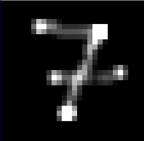

# perceptron

This is a work in progress digit recognition program that I am working on.

Running
-------

### Nix / Unix
The recommended way of running continuity on unix systems is by using the nix flake. Simply install Nix on your system and run `nix --extra-experimental-features nix-command --extra-experimental-features flakes run github:AndreiSva/continuity`. This will download all the dependencies and run the simulation.
